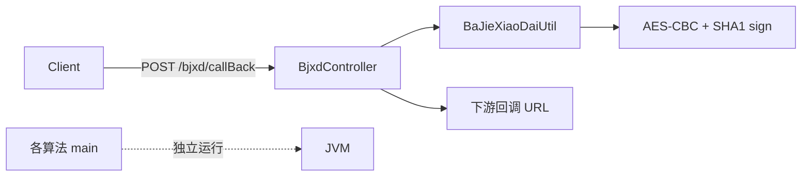

# Params

Maven 工程 `org:Params:0.0.1-SNAPSHOT`，基于 **Spring Boot 3.2.7** / **Java 17**，默认端口 **10086**（见 [`src/main/resources/application.properties`](src/main/resources/application.properties)）。

仓库里混有两块内容：

1. **贷超 / 合作方集成**：八戒小贷回调加解密转发、如意花风格 DTO、AES / RSA / HTTP / PMT 等工具
2. **算法练习（偏软考下午题）**：排序、动态规划、贪心、回溯

## 架构示意



## 目录与职责

| 区域 | 路径 | 作用 |
|------|------|------|
| 启动类 | [`ParamsApplication.java`](src/main/java/org/params/ParamsApplication.java) | Spring Boot 入口 |
| 八戒小贷 | [`org.params.bjxd`](src/main/java/org/params/bjxd/) | 唯一 Web 接口 + 加签加密常量 |
| 公共层 | [`org.params.common`](src/main/java/org/params/common/) | AjaxResult、DTO、异常、AES/RSA/HTTP/日期/PMT/雪花 ID |
| 算法 | `sort/`、`dynamicprogramming/`、`backtracking/`、`sort/Afternoon/` | 独立 `main` 演示，多数不挂 HTTP |
| 测试 | [`src/test/java`](src/test/java/org/params/) | 上下文加载 + 01 背包断言 |

## 业务接口

- **`POST /bjxd/callBack`**（[`BjxdController`](src/main/java/org/params/bjxd/BjxdController.java)）  
  对请求体做 AES 加密 + SHA-1 签名，转发飞书 / 减免类回调。  
  示例：`POST /bjxd/callBack?prod=<prod>`，JSON body 为回调载荷。  
  注意：密钥与 clientId 目前写在源码常量中，不宜直接用于生产。

## 算法清单

| 类别 | 内容 | 主要位置 |
|------|------|----------|
| 排序 | 快速 / 堆 / 归并 | `org.params.sort`、`org.params.sort.Afternoon`（归并有两份） |
| 动态规划 | 01 背包、LCS、矩阵连乘 | `sort/Afternoon/动态规划/`、`org.params.dynamicprogramming` |
| 贪心 | 活动选择 | `ActivitySelectionGreedy` |
| 回溯 | N 皇后（两套） | `org.params.backtracking`、`Afternoon/NQueensBacktracking` |

## 构建与运行

```bash
mvn clean package
mvn spring-boot:run          # 端口 10086
# 或
java -jar target/Params-0.0.1-SNAPSHOT.jar

mvn test
```

算法类可直接运行各自的 `main`，不必启动 Web 应用。

## 主要依赖

- `spring-boot-starter-web`、Lombok、Fastjson、Hutool
- Apache HttpClient、commons-codec、BouncyCastle
- MyBatis-Plus 在 `pom.xml` 中已注释

## 已知风险与后续方向

当前已知问题（便于后续改造时对照）：

- **密钥硬编码**：AES / RSA / BaJie token 等出现在源码中
- `pom.xml` 中 `httpclient` 重复声明
- Jakarta Validation 版本与 Spring Boot 3 / `javax.validation` import 可能不一致
- 存在草稿或可疑代码（如 `zeroOneTest`、QuickSort `main` 可能只排半边数组）
- 中文包名 `动态规划`；测试覆盖较薄

可选后续工作（按需指定即可）：

1. 整理算法目录、去掉重复实现  
2. 将密钥抽离到配置 / 环境变量  
3. 修复依赖与校验注解不一致  
4. 补齐接口与算法单元测试  
5. 清理草稿类、修正已知算法 demo 问题  
